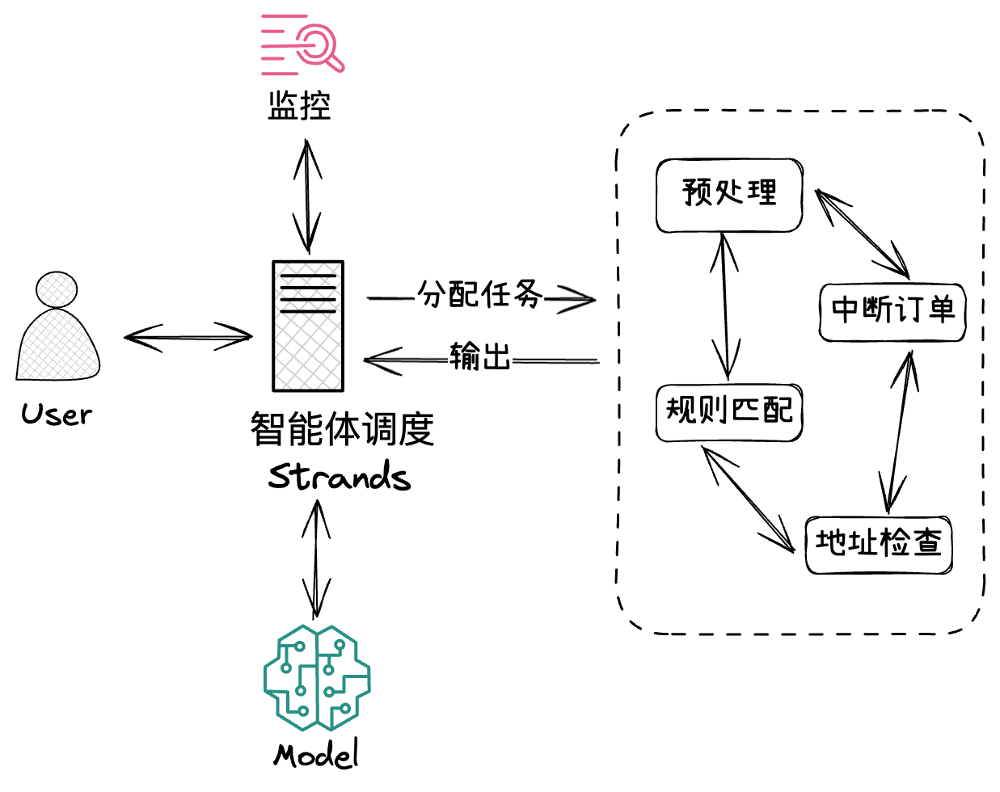

> 实验时长： 本实验预计可以在 1 小时内完成。

在人工智能飞速发展的今天，Agentic AI正成为下一代生成式AI技术的核心范式。它超越了传统AI的被动响应模式，通过赋予AI自主规划、记忆、工具调用及协作能力，使其能够像人类一样主动理解、分解并解决复杂问题。从提升企业效率的垂类Agent到多Agent协同的生态系统，Agentic AI 正在重塑人机交互的边界，并为各行各业带来前所未有的智能化变革。

在本实验中基于Strands Agents SDK开发的亚马逊云科技智能客服助手应用，通过MCP的集成，实现了大语言模型与外部工具系统的无缝连接。Strands SDK作为核心引擎，提供了强大的代理能力和工具集成机制，使得整个系统具备了高度的可扩展性和实用性。

## 使用 Strands Agents 构建智能客服架构说明

## 手册内容
### Strands Agents SDK
- 前后端分离架构  
- 基于React的用户界面  
- 多种MCP工具集成    
- 持多种模型提供商  
- 用户会话管理

### MCP Server
- 通过MCP Server实现不同工具调用  
- 提供数据预处理、意图识别等业务类型工作流/智能体的最佳实践，举一反三

### 已预置的环境
本次Workshop已经预置了以下云资源：
- EC2实例用于部署基于Strands Agents SDK开发的端到端应用助手
- S3存储桶 voc-code-xxx 用于订单模拟以及意图识别表格存储和strands-xxxx 用于lambda层补充代码或数据的.zip 文件存储
- LLM使用亚马逊云科技Marketplace硅基流动Deepseek-V3模型。
- Athena数据库excel_db用于订单模拟和意图识别表格查询。