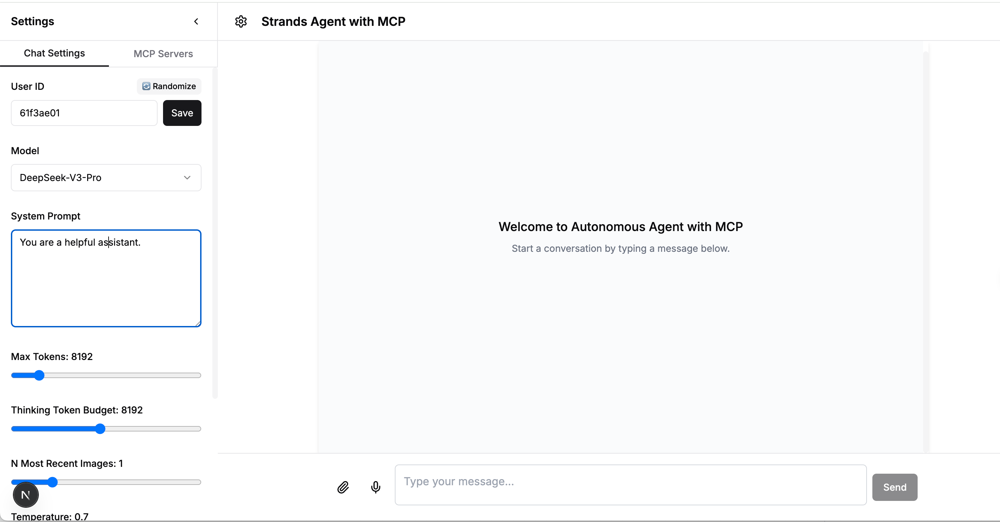

## 登录亚马逊云科技中国区账号

点击右上角开始实验，您会进入亚马逊云科技管理控制台。请注意右上角的区域应选择为中国（宁夏）。

## 环境准备

在亚马逊云科技的管理控制台的搜索栏中搜索`Cloudformation`，您可以在 CloudFormation 控制台中找到 `VOC-strands-workshop`的堆栈。在堆栈的 `输出` 标签页中，您可以找到`StrandsEC2Instance`，`EC2PublicIP`，`ProxyEndpointURL`这两个参数。


`StrandsEC2Instance`是运行基于Strands Agents SDK开发的亚马逊云科技智能客服助手应用的EC2。

`EC2PublicIP`提供的前端交互页面。

`ProxyEndpointURL`是智能客服售后应用的接口, 后续配置MCP Server的时候会用到这里的URL。

在亚马逊云科技控制台顶部的搜索栏中，输入“EC2”，进入EC2的控制台页面。找到`Strands-EC2-Instance的实例`，选中这台机器，点击右上角`连接`


继续点右下角`连接`


进入linux终端界面, 运行命令切换用户进入工程文件夹,把env.example 改成.env,根据情况取消注释,，修改以下变量：

```bash
su ubuntu
cd /home/ubuntu/sample_agentic_ai_strands
cp env.example .env
```
* 使用vim 打开.env文件编辑：

本试验使用的是x86服务器做编译，可以设置PLATFORM=linux/amd64，否则跨平台编译速度慢好几倍

进入项目根目录，将 env.example 改成 .env，根据实际情况修改以下变量包括：
  - `AWS_REGION`
  - `CLIENT_TYPE`  
  - `STRANDS_MODEL_PROVIDER`  
  - `OPENAI_API_KEY`  
  - `OPENAI_BASE_URL`
  - `AWS_ACCESS_KEY_ID` 
  - `AWS_SECRET_ACCESS_KEY`

```bash
# =============================================================================
# AWS Infra CONFIGURATION
# The default ECS platform is arm64, you can choose linux/amd64 
# =============================================================================
PLATFORM=linux/amd64
#AWS_REGION=your_region_to_deploy(必须填，方案部署区，例如如果是北京区用cn-north-1 or 宁夏区域cn-northwest-1)


# ============================
# 如果需要使用Bedrock模型，配置如下
# ============================
#STRANDS_MODEL_PROVIDER=bedrock

# ============================
# 如果在中国区，使用openai兼容接口的模型，需要如下Strands 配置
# ============================
# STRANDS_MODEL_PROVIDER=openai
#OPENAI_API_KEY=your-model-provider-key
#OPENAI_BASE_URL=your-model-provider-base-url(例如https://api.siliconflow.cn/v1)

AWS_REGION=cn-northwest-1
CLIENT_TYPE=strands
STRANDS_MODEL_PROVIDER=openai
OPENAI_API_KEY=your_openai_api_key
OPENAI_BASE_URL=https://api.siliconflow.cn/v1

# ============================
# Langfuse 配置 (可选) 
# ============================
LANGFUSE_PUBLIC_KEY=your-public-key
LANGFUSE_SECRET_KEY=your-secret-key
LANGFUSE_HOST=https://your-langfuse-host

# =============================================================================
# AWS BEDROCK CONFIGURATION (for Bedrock provider, if not set, it will use same credential as AWS Infra)
# =============================================================================

#BEDROCK_AWS_ACCESS_KEY_ID=your_aws_access_key_id
#BEDROCK_AWS_SECRET_ACCESS_KEY=your_aws_secret_access_key
#BEDROCK_AWS_REGION=us-east-1

# =============================================================================
# mem0 CONFIGURATION
# Only used if ENABLE_MEM0=true
# If STRANDS_MODEL_PROVIDER=bedrock, it will use models in Bedrock
# =============================================================================
# 使用mem0将额外增加8-10分钟的部署时间
#ENABLE_MEM0=true
#LLM_MODEL=us.amazon.nova-pro-v1:0
#EMBEDDING_MODEL=amazon.titan-embed-text-v2:0
```  

如果需要可观测性，可以去`https://us.cloud.langfuse.com/` 注册一个免费账号，然后把key和host信息填入上面的.env中,对应参数为**LANGFUSE_SECRET_KEY**，**LANGFUSE_PUBLIC_KEY**，**LANGFUSE_HOST**

### 配置模型选择
修改conf/config.json配置加入模型，默认配置是配置了DeepSeek-V3和R1版本
```json
  {
    "model_id": "Pro/deepseek-ai/DeepSeek-R1",
    "model_name": "DeepSeek-R1-Pro"
  },
  {
    "model_id": "deepseek-ai/DeepSeek-V3",
    "model_name": "DeepSeek-V3-free"
  }
```

### 启动后端服务

运行如下命令启动后端
```bash
bash start_all.sh 
```

### 启动前端页面
进入react_ui目录，启动前端镜像，运行以下命令
```bash
cd react_ui
docker-compose build --build-arg USE_CHINA_MIRROR=true
docker-compose up -d
```

启动前端镜像, 您需要等待几分钟

### 在浏览器中访问 http://<`EC2PublicIP`>:3000/chat

其中`EC2PublicIP`为`Cloudformation`中输出所对应的IP地址，点击MCP Servers Tab，等待10～20秒，直到刷出Servers,表明前端加载完毕



### 其他Docker常用命令
```bash
# 查看容器日志
docker logs -f mcp-bedrock-ui

# 重启容器
docker-compose restart

# 停止容器
docker-compose down

# 重新构建并启动（代码更新后）
docker-compose up -d --build
```

至此，您已经完成基于Strands Agents SDK开发的端到端的Agentic AI 应用的环境配置。

