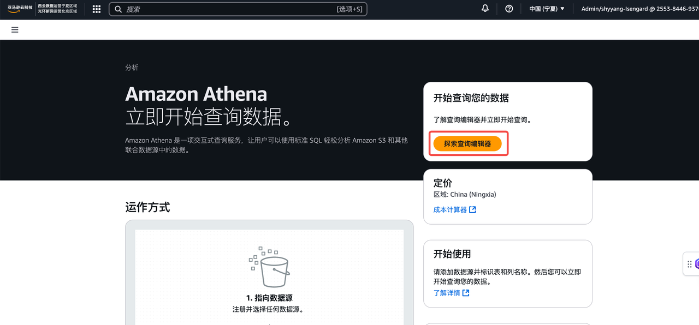
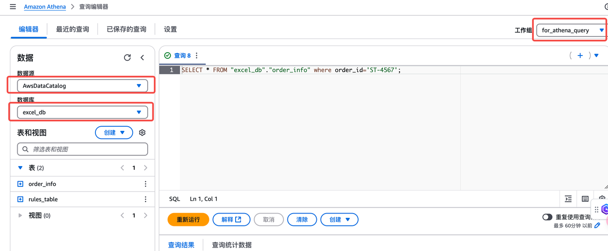
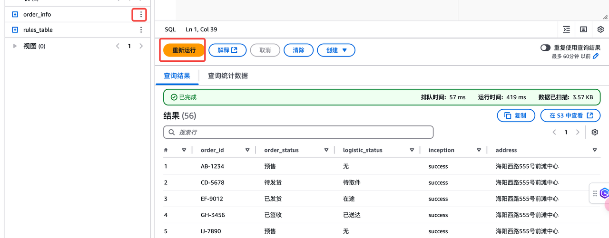

在本次实验中，我们在S3中模拟了一个用户的订单，Agent会通过调用API的方式访问这张订单表格查询订单状态以及收货地址等信息，并结合事先定义好的规则匹配进行用户反馈。您可以在Athena中查询订单信息，以及规则匹配的表格，探究大模型如何根据业务要求来进行工具的调用。

进入到亚马逊云科技控制台，搜索`Athena` ，进入到Athena界面，点击右上角的`搜索查询编辑器`：



修改右上角工作组改为`for_athena_query`，修改数据源为`AwsDataCatalog`, 数据库为 `excel_db`，您可以查询到对应表格的数据。例如：

```
SELECT * FROM "excel_db"."order_info" limit 10;
SELECT * FROM "excel_db"."rules_table" limit 10;
```




其中，`order_info`模拟存储了用户订单信息，`rules_talbe`用于存储用户意图识别匹配表格。
