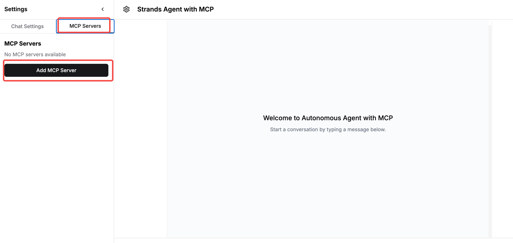
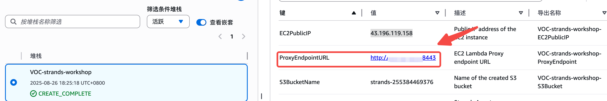
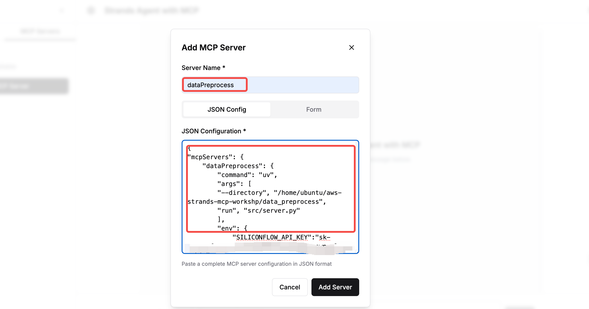
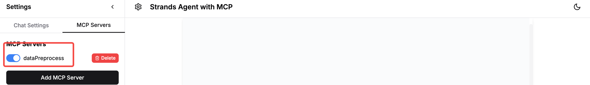
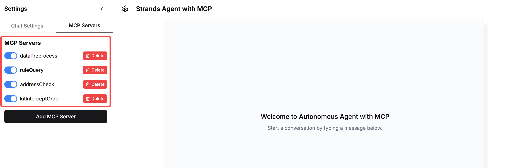

### 1.设置MCP Server

#### 1.1. 左边栏切换到MCP Servers Tab，点击“Add MCP Server”按钮添加依次添加所需要的MCP Server  



本试验中已经提前下载了该MCP server的代码到服务容器中，只需配置JSON如下,修改硅基流动API Key的值以及API Endpoint的值，其中API Endpoint的值替换成之前cloudformation中输出的`ProxyEndpointURL`



```json
{
    "mcpServers": {
        "dataPreprocess": {
            "command": "uv",
            "args": [
                "--directory", "/home/ubuntu/aws-strands-mcp-workshp/data_preprocess",
                "run", "src/server.py"
            ],
            "env": {
                "SILICONFLOW_API_KEY":"<硅基流动API-KEY>",
                "API_ENDPOINT": "<cloudformation中输出的ProxyEndpointURL>"
            }
        }
    }
}
```

添加MCP相关配置，并点击Add Server

  

添加成功后会在MCP Server下显示

  

#### 1.2. 依次安装本Demo需要用的MCP 服务器：

*  ruleQuery：用于用户问题规则匹配

配置JSON如下：  
```json
{
"mcpServers": {
    "ruleQuery": {
        "command": "uv",
        "args": [
        "--directory", "/home/ubuntu/aws-strands-mcp-workshp/rule_query",
        "run", "src/rule_query.py"
        ],
        "env": {
            "SILICONFLOW_API_KEY":"<硅基流动API-KEY>",
            "API_ENDPOINT": "<cloudformation中输出的ProxyEndpointURL>"
        }
    }
}
}
```

*  kitAddressCheck：检查客户修改地址与当前配送地址的关系

配置JSON如下：  
```json
{
"mcpServers": {
    "kitAddressCheck": {
        "command": "uv",
        "args": [
        "--directory", "/home/ubuntu/aws-strands-mcp-workshp/kit_address_check",
        "run", "src/kit_address_check.py"
        ],
        "env": {
            "SILICONFLOW_API_KEY":"<硅基流动API-KEY>",
            "API_ENDPOINT": "<cloudformation中输出的ProxyEndpointURL>"
        }
    }
    }
}
```

*  kitInterceptOrder：处理需要中断的订单

配置JSON如下：  
```json
{
"mcpServers": {
    "kitInterceptOrder": {
        "command": "uv",
        "args": [
        "--directory", "/home/ubuntu/aws-strands-mcp-workshp/kit_intercept_order",
        "run", "src/kit_intercept_order.py"
        ]
    }
    }
}
```

添加结束以后显示的MCP Servers列表如下：

   

至此，您已经完成所有工具配置。

**Strands Agents 的核心代码解读（Optional）**

本章节会聚焦使用 Strands Agents 框架如何快速开发当前 Agent 的核心逻辑（以添加data_preprocess为例）。如果想继续实验请点击下一步。

* data_preprocess：主要负责对于舒服内容的预处理  

**模型集成**

Strands Agents 本身支持多模型供应商，只需要初始化不同的 Model Provider，就可以支持 OpenAI 兼容接口的模型等。

以下这个核心示例代码中，演示了如何使用DeepSeek模型开发 Agent：

```python
def _get_model(self, model_id, thinking, thinking_budget, max_tokens=1024, temperature=0.7):
    """根据提供商获取适当的模型"""
    if self.model_provider == 'openai':
        return OpenAIModel(
            client_args={
                "api_key": self.api_key, # 硅基流动API Key
                "base_url": "https://api.siliconflow.cn" # 这里填写硅基流动的Base URL
            },
            model_id="deepseek-ai/DeepSeek-R1",
            params={
                "max_tokens": max_tokens,
                "temperature": temperature,
            }
        )
```

硅基流动 API 默认兼容 OpenAI 接口，我们可以通过配置 OpenAI model provider 来实现 Strands Agent 对接。 其中**model_provider** 会读取 **1.2**中所配置的环境变量的**STRANDS_MODEL_PROVIDER**字段，用于适配不同的模型接入方式。

**工具集成**

Strands Agent SDK 提供了 MCP Client 能力，支持包括 stdio，streamable http，sse，自定义传输层四种类型的 MCP Server 集成。

本方案中已经提前下载了该MCP server的代码到服务容器中，只需配置JSON如下：  

```json
{
    "mcpServers": {
        "dataPreprocess": {
            "command": "uv",
            "args": [
                "--directory", "/home/ubuntu/aws-strands-mcp-workshp/data_preprocess",
                "run", "src/server.py"
            ],
            "env": {
                "SILICONFLOW_API_KEY":"<硅基流动API-KEY>>",
                "API_ENDPOINT": "<上一步骤中生成的api_endpoint>"
            }
        }
    }
}
```
配置好MCP的JSON后，会通过`initialize_user_servers`来初始化所要运行的MCP Server

```python
async def initialize_user_servers(session: UserSession):
    """初始化用户特有的MCP服务器"""
    user_id = session.user_id
    
    # 获取用户服务器配置（现在是异步方法）
    server_configs = await get_user_server_configs(user_id)
    
    global_server_configs = get_global_server_configs()
    # 合并全局和用户的servers
    server_configs = {**server_configs, **global_server_configs}
    
    logger.info(f"server_configs:{server_configs}")
    # 初始化服务器连接
    for server_id, config in server_configs.items():
        if server_id in session.mcp_clients:  # 跳过已存在的服务器
            logger.info(f"skip {server_id} initialization ")
            continue
            
        try:
            # 创建并连接MCP服务器
            if session.client_type == 'strands':
                mcp_client = StrandsMCPClient(name=f"{session.user_id}_{server_id}")
            else:
                raise ValueError("only support client_type strands")
            server_url = config.get('url',"")
            
            await mcp_client.connect_to_server(
                server_id=server_id,
                command=config.get('command'),
                server_url=server_url,
                http_type= "sse" if is_endpoint_sse(server_url) else "streamable_http" ,
                token=config.get('token', None),
                server_script_args=config.get("args", []),
                server_script_envs=config.get("env", {})
            )
            
            # 添加到用户的客户端列表
            session.mcp_clients[server_id] = mcp_client
            await save_user_server_config(user_id, server_id, config)
            logger.info(f"User Id {session.user_id} initialize server {server_id}")
            
        except Exception as e:
            logger.error(f"User Id  {session.user_id} initialize server {server_id} failed: {e}")
```

以下这个核心示例代码中，展示了 stdio，streamable http，sse 三种传输层类型的 MCP Server 如何连接。对于`data_preprocess`，相当于运行`uv run /home/ubuntu/aws-strands-mcp-workshp/data_preprocess/src/server.py` 这个命令启动MCP Server

```python
async def connect_to_server(self, server_id: str, command: str = "", 
                           server_script_path: str = "", 
                           server_script_args: List[str] = [], 
                           server_script_envs: Dict = {}, 
                           server_url: str = "", 
                           http_type: str = 'stdio', token: str = ""):
    """使用Strands MCP客户端连接到MCP服务器"""
    if server_url:
        # 基于HTTP的服务器
        if http_type == 'sse':
            headers = {"Authorization": f"Bearer {token}"} if token else None
            mcp_client = MCPClient(lambda: sse_client(server_url, headers=headers))
        elif http_type == 'streamable_http':
            headers = {"Authorization": f"Bearer {token}"} if token else None
            mcp_client = MCPClient(lambda: streamablehttp_client(server_url, headers=headers))
    else:
        # 基于Stdio的服务器
        params = StdioServerParameters(
            command=command,
            args=server_script_args,
            env=server_script_envs
        )
        mcp_client = MCPClient(lambda: stdio_client(params))
    
    # 启动服务器
    mcp_client.start()
```

**Agent 核心逻辑集成**

Strands Agent 是一个以模型驱动为优先的 Agent 开发框架。我们只需要重点关注工具、系统提示词、上下文和模型，就能创建一个自主型 Agent。以下核心示例代码展示了这个设计理念：

在这个核心示例代码中，我们创建了一个单体 Agent，为其提供了 MCP 工具和内置的长短期记忆管理工具（mem0_memory），同时指定了模型和上下文管理器 conversation_manager（用于管理最长的消息长度，避免 context 过长），以及系统提示词。通过这种简单的方式，我们就能创建一个具有自主推理能力、能够使用各种外部工具、并拥有长短期记忆和上下文管理功能的 Agent。


```python
async def _create_agent_with_tools(self, model_id, messages, mcp_clients=None, 
                                 mcp_server_ids=None, system_prompt=None,
                                 thinking=True, thinking_budget=4096, 
                                 max_tokens=1024, temperature=0.7):
    """创建带有MCP工具的Strands代理"""
    
    # 创建MCP工具
    tools = await self._create_mcp_tools(mcp_clients, mcp_server_ids)
    
    # 添加内置长短期记忆工具mem0_memory
    tools += [mem0_memory]
    # 获取模型
    model = self._get_model(model_id, thinking=thinking, 
                           thinking_budget=thinking_budget,
                           max_tokens=max_tokens, temperature=temperature)
    
    # 创建Agent
    agent = Agent(
        model=model,
        messages=messages,
        conversation_manager=SlidingWindowConversationManager(
            window_size=window_size,
        ),
        system_prompt=system_prompt or "You are a helpful assistant.",
        tools=tools
    )
    
    return agent
```

上段代码片段中首先使用 `_get_model`获取自定义的模型接口，通过`_create_mcp_tools`初始化当前用户配置的MCP Server，最后通过`Agent`将模型、工具和提示词进行整合返回用于执行用户指令的Agent对象。
